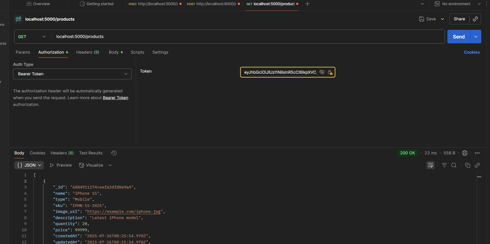

 Inventory Management Backend

 Setup

1. Clone the repo
2. Run `npm install`
3. Copy `.env.example` to `.env` and fill values
4. Run locally:
npm run dev
   

##  Tech Stack

| Technology     | Use                                  |
|----------------|---------------------------------------|
| Node.js        | Server-side runtime                   |
| Express.js     | Web framework                         |
| MongoDB        | NoSQL database                        |
| Mongoose       | MongoDB ODM (schema definitions)      |
| JWT (jsonwebtoken) | Secure authentication             |
| Bcrypt.js      | Password hashing                      |
| Swagger (OpenAPI) | API documentation & testing        |
| Dotenv         | Environment variable management       |
| Nodemon        | Dev auto-restart server               |

---

🐳 Docker Instructions

📌 Step 1: Move to backend folder

cd backend

🧱 Step 2: Build the Docker image

docker build -t ims-backend .

🚀 Step 3: Run the container

docker run -p 5000:5000 --env-file .env ims-backend

✅ Application will be running at:
http://localhost:5000

✅ Swagger docs available at:
http://localhost:5000/api-docs

##  API Testing Proof (Screenshots)

Below are screenshots demonstrating successful testing of all APIs using Postman:

| Endpoint                      | Screenshot                      |
|------------------------------|----------------------------------|
| POST /login                  |  |
POST /register                  |  |
| POST /products               |  |
| GET /products                |  |
| PUT /products/:id/quantity   |  |

🧭 API Flows
This section explains how a user interacts with the backend system in a typical flow:

🔐 1. User Authentication Flow
User registers via:

POST /register
Body:
{
  "username": "admin",
  "password": "admin123"
}

POST /login
Body:
{
  "username": "admin",
  "password": "admin123"
}
Server returns a JWT access token:

{
  "access_token": "eyJhbGciOiJIUzI1NiIsInR..."
}
This token is used for all protected routes by including it in headers:

Authorization: Bearer <access_token>
 2. Product Management Flow
 All below routes require a valid JWT token.

a. Add a Product

POST /products
Headers:
  Authorization: Bearer <token>

Body:
{
  "name": "iPhone 15",
  "type": "Mobile",
  "sku": "IPH-15-2025",
  "image_url": "https://example.com/iphone.jpg",
  "description": "Apple iPhone 15",
  "quantity": 20,
  "price": 99999
}
b. Get All Products

GET /products
Headers:
  Authorization: Bearer <token>
→ Returns array of product objects.

c. Update Quantity of a Product

PUT /products/:id/quantity
Headers:
  Authorization: Bearer <token>

Body:
{
  "quantity": 35
}
→ Updates only the quantity of the specified product ID.
  
## API Docs
Visit [http://localhost:5000/api-docs](http://localhost:5000/api-docs)